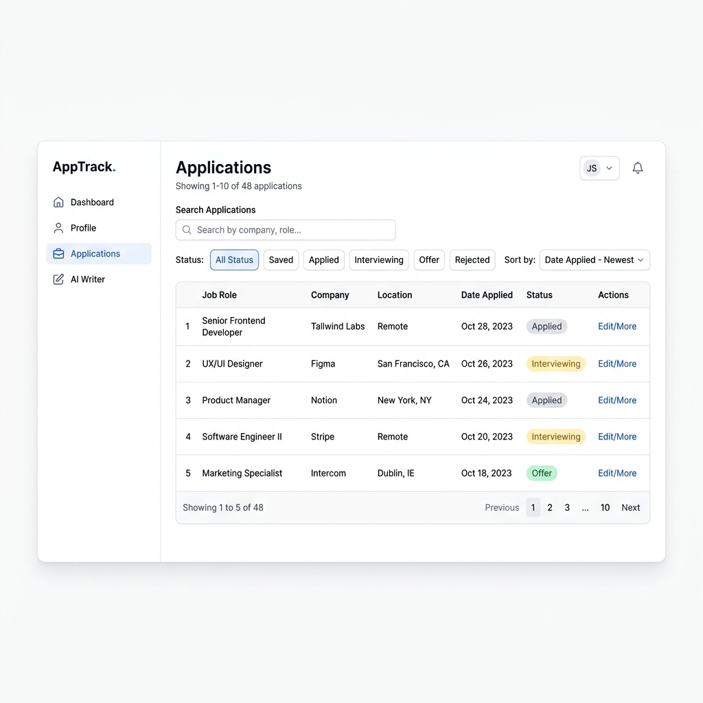
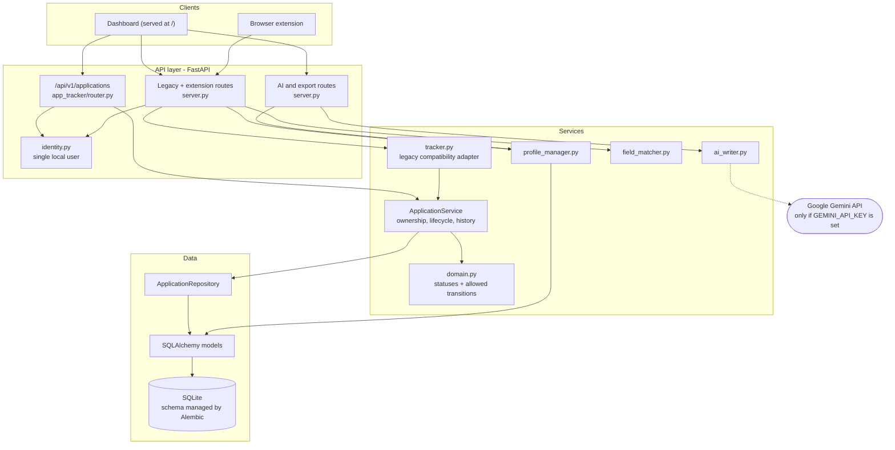

# Job Copilot

[](https://github.com/ManoharVit/job-copilot/actions/workflows/ci.yml)
[](LICENSE)




Job Copilot is an AI-assisted career platform designed to help job seekers discover roles, tailor resumes, prepare for interviews, and track job applications efficiently. 

> **SECURITY & DEVELOPMENT NOTICE**
> 
> This project is currently in **active development** and is designed for **local use only**. 
> - **No Authentication Yet:** The server binds to `127.0.0.1` and assumes a single local user. Do not deploy this to a public server or expose it to the internet.
> - **Data Privacy:** Your profile, resumes, and application tracking data are stored locally in an SQLite database. Never commit your `.env` or personal data.

## Features & Status

| Feature | Status | Notes |
|---------|--------|-------|
| **Application Tracking** | Implemented | Local-only tracking with status history. |
| **Profile Management** | Implemented | Single-user local profile. |
| **Resume Tailoring** | Experimental | Requires Gemini API Key. |
| **Cover Letter Gen** | Experimental | Requires Gemini API Key. |
| **Interview Prep** | Experimental | Requires Gemini API Key. |
| **Authentication** | Planned | Local single-user mode only right now. |
| **External Integrations** | Planned | No live job board submissions yet. |

## Quickstart

1. **Clone the repository and prepare the environment:**
   ```bash
   python -m venv .venv
   source .venv/bin/activate
   pip install -r requirements.txt
   ```

2. **Configure your environment:**
   Copy `.env.example` to `.env` and fill in your Gemini API key if you want to use the AI features.
   ```bash
   cp .env.example .env
   ```

3. **Run the application:**
   ```bash
   ./start.sh
   ```
   On first run, `start.sh` creates the schema for a brand-new empty database. If you already have a database with an older schema, it **refuses to start and changes nothing** until you migrate it explicitly (below).

   **Upgrading an existing database** (back it up first!):
   ```bash
   cp data/copilot.db data/copilot.db.bak
   cd backend && alembic upgrade head
   ```

## Architecture

Job Copilot runs entirely on your machine: a FastAPI backend with a local SQLite database
serves both the dashboard and the browser extension.



- **Application Tracker** follows API → Service → Repository → Database. Business rules (ownership,
  allowed status transitions, history) live in the service and domain layers, not the routes.
- **Legacy routes** keep the original dashboard and extension working. They delegate to the same
  service through `tracker.py`, so both paths enforce the same rules.
- **AI features** are optional. With no API key, they make no external calls.

Further reading:

- [API reference with curl examples](docs/api.md), or interactive docs at `http://127.0.0.1:8000/docs` while the server runs
- [Application Tracker design](docs/modules/application-tracker.md)
- [Development notes](docs/development.md) and [Contributing guide](CONTRIBUTING.md)
